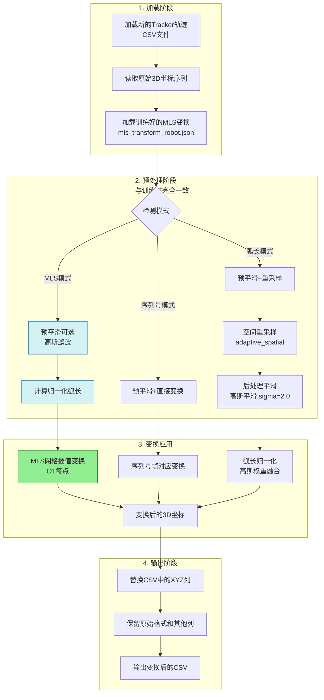

# MLS 点云配准复用工作流详解 (apply_transform.py)

本文档详细描述了使用 `apply_transform.py` 将训练好的 MLS 变换模型应用到新的 Tracker 轨迹数据的完整复用流程。



---

## 核心设计理念

### 为什么复用流程要与训练流程一致？

**关键原则**: **预处理必须完全一致**

训练时的数据流程：
```
原始数据 → 预平滑 → 重采样 → 后平滑 → MLS训练
```

复用时的数据流程：
```
原始数据 → 预平滑 → 重采样 → 后平滑 → MLS应用
```

**为什么**：
- MLS 学习的是"预处理后空间"的变换关系
- 如果新数据不经过相同预处理，点的分布、密度、噪声特性都会不同
- 导致 MLS 查询到错误的归一化弧长位置，应用错误的变换

**类比**：训练时在"平滑的1463mm轨迹"上学习，复用时给"含噪声的1733mm轨迹"，MLS 会找错对应位置。

---

## 第一阶段：加载阶段 (Loading)

### 1.1 加载新的 Tracker 轨迹
**作用**: 读取需要转换坐标系的新轨迹数据。

**输入**: 
- `input.csv` - 新的 Tracker 轨迹（灯塔坐标系）
- 通常包含 2000-3000 个连续时间戳的 3D 坐标

**输出**: 原始 3D 点序列（N×3 数组）

**典型场景**:
- 训练时用 `tracker6.csv`（教学轨迹）训练 MLS 模型
- 复用时用 `tracker_new.csv`（实际生产轨迹）应用变换

---

### 1.2 加载 MLS 变换模型
**作用**: 加载训练阶段保存的 MLS 模型（包含网格变换矩阵或完整训练数据）。

**文件**: `mls_transform_robot.json` (190.5KB)

**⚠️ 重要提醒 - 坐标系转换**:
训练输出的 `mls_transform.json` 是**灯塔坐标系**，必须先经过 `convert_segmented_transform.py` 转换为 `mls_transform_robot.json`（机器人坐标系），才能用于复用！

**转换原理**:
```
T^R = T_L^R @ T^L @ (T_L^R)^(-1)
```
其中 $T_L^R$ 是手眼标定矩阵（灯塔→机器人）。

**模型内容**:
1. **网格变换** (推荐模式):
   - 200 个预计算的 4×4 变换矩阵
   - 对应归一化弧长 [0,1] 上的均匀采样点
   - 复用时 O(1) 插值查询

2. **完整训练数据** (高精度模式):
   - 577 对源点-目标点
   - 归一化弧长
   - 复用时 O(N²) 完整 MLS 计算

3. **元数据**:
   - 带宽 $h = 0.026$
   - 训练轨迹总弧长 1423.65mm
   - 预处理参数（必须与复用时一致）

---

### 1.3 检测模式
**作用**: 根据 JSON 中的 `mode` 字段，自动选择合适的变换策略。

**支持的模式**:
1. **MLS 模式** (`mode: "mls"`):
   - 移动最小二乘连续变形场
   - 适用于训练和复用轨迹**不是同一轨迹**的情况
   - 通过归一化弧长查找对应关系

2. **序列号对应模式** (`mode: "sequence_aligned"`):
   - 训练和复用是**同一轨迹的不同坐标系观测**
   - 帧号一一对应，无需弧长猜测
   - 跳过重采样，保持帧数一致

3. **弧长模式** (`mode: "arc_length"`):
   - 传统分段 Kabsch 配准
   - 基于高斯权重的弧长插值

---

## 第二阶段：预处理阶段 (Preprocessing)

### 2.1 预平滑（可选）
**作用**: 与训练时一致的噪声压制。

**当前配置**: 
- `PRE_SMOOTH["enable"] = True`
- `gaussian_sigma = 1.5`

**MLS 模式下的处理**:
- 如果训练时用了预平滑 → 复用时**必须**用相同参数
- 如果训练时跳过 → 复用时也**必须**跳过

**效果**: 消除高频抖动，使后续的弧长计算更稳定。

---

### 2.2 空间重采样（MLS/弧长模式）
**作用**: 将新轨迹重采样到与训练时相同的采样空间。

#### 为什么需要重采样？
训练时对 2612 点的轨迹重采样为 729 点（约每 2mm 一个点），MLS 学习的是这个 729 点空间的变换。

如果新轨迹有 3000 点（密度不同），不重采样直接应用会导致：
- 归一化弧长对应错误
- 网格插值位置偏移
- 变换质量下降

#### 当前使用方法 (adaptive_spatial):
1. 计算累积弧长
2. 自适应步长: `Δd = noise_suppression_factor × noise_level`
3. 等弧长插值

**参数**（必须与训练时完全一致）:
- `noise_level = 0.5mm`
- `noise_suppression_factor = 2.0`
- `min_samples = 100`, `max_samples = 5000`

**输出**: 重采样后的轨迹（点数接近训练时的 729 点）

---

### 2.3 后处理平滑
**作用**: 对重采样后的轨迹再次高斯平滑。

**参数**: `gaussian_sigma = 2.0`（与训练时一致）

**为什么需要**: 
- 重采样后仍可能有残留噪声
- MLS 对局部形变敏感，平滑的输入能获得更稳定的变换

**效果**: 轨迹更光滑，MLS 权重计算更准确。

---

### 2.4 计算归一化弧长（MLS 模式）
**作用**: 将预处理后的轨迹弧长归一化到 [0,1] 区间。

**计算**:
```python
arc_lengths = compute_arc_length(points)  # 累积弧长
total_length = arc_lengths[-1]            # 总弧长
normalized_arc = arc_lengths / total_length  # 归一化
```

**为什么归一化**:
- 训练轨迹弧长 1463mm，新轨迹可能 1500mm 或 1400mm
- 归一化后都是 [0,1]，使得"轨迹起点"="0"、"轨迹终点"="1"
- MLS 在归一化空间中查找对应关系

**示例**:
- 训练轨迹: 1463mm → [0, 1]
- 新轨迹: 1500mm → [0, 1]
- 位于 750mm 处的点 → 归一化位置 0.5 → 映射到训练轨迹的 731.5mm 处

---

## 第三阶段：变换应用 (Transformation)

### 3.1 MLS 网格插值变换（推荐，O(1)每点）
**作用**: 快速应用 MLS 变换，通过预计算网格的线性插值。

**流程**:
1. 对预处理后的每个点，查询其归一化弧长 $s \in [0,1]$
2. 在 200 个网格点中用二分查找定位: $s_{\text{left}} \leq s \leq s_{\text{right}}$
3. 计算插值系数: $t = \frac{s - s_{\text{left}}}{s_{\text{right}} - s_{\text{left}}}$
4. 对两个网格点的变换结果线性插值:
   ```python
   P'_left = T_left @ [x, y, z, 1]
   P'_right = T_right @ [x, y, z, 1]
   P' = (1-t) * P'_left + t * P'_right
   ```

**优点**: 
- 速度极快，O(1) 每点
- 对 3000 点轨迹，仅需 3000 次插值运算

**精度**:
- 200 个网格点对 1463mm 弧长 → 每 7.3mm 一个网格
- 线性插值误差 < 0.5mm（已在训练时验证）

---

### 3.2 MLS 完整计算（高精度，O(N²)每点）
**作用**: 对每个点执行完整的加权 Kabsch 计算，获得最高精度。

**流程**:
1. 对预处理后的每个点 $P$，查询其归一化弧长 $s$
2. 计算到所有 577 个训练点的权重:
   ```python
   w_i = exp(-(s - s_i)^2 / h^2)
   ```
   其中 $h = 0.026$（训练时选出的带宽）
3. 用加权的源点和目标点计算 SVD 分解，得到局部变换 $(R(s), t(s))$
4. 应用变换: $P' = R(s) \cdot P + t(s)$

**优点**: 
- 精度最高，与训练时的计算完全一致
- 适合对少量关键点的精确转换

**缺点**: 
- 速度慢，每个点需要遍历 577 个训练点
- 对 3000 点轨迹，需要 3000 × 577 = 173 万次权重计算

**何时使用**: 
- 网格插值精度不满足要求时
- 需要验证网格插值误差时

---

### 3.3 序列号对应变换（同一轨迹模式）
**作用**: 当训练数据和复用数据是同一轨迹的不同坐标系观测时，直接按帧号对应变换。

**前提条件**:
- 训练时 `tracker6.csv` 和 `tcp6.csv` 必须是同步采集的同一运动
- 复用时新数据帧数必须与训练时完全一致（如都是 2612 帧）

**优势**:
- **跳过重采样**：保持原始帧数和时间戳
- **精确对应**：第 i 帧对应第 i 帧，无需弧长猜测
- **最高精度**：避免了弧长对齐带来的插值误差

**流程**:
1. 验证帧数一致性: `len(new_data) == total_frames`
2. 对每帧 $i$，计算到所有分段中心帧的权重（高斯权重）
3. 加权融合各分段的变换矩阵
4. 应用到第 $i$ 帧

**应用场景**: 
- 手眼标定验证
- 同步采集的轨迹对比

---

### 3.4 弧长高斯权重融合（分段 Kabsch）
**作用**: 传统分段配准的变换应用。

**流程**:
1. 计算归一化弧长 $s$
2. 计算到各分段中心的高斯权重:
   ```python
   w_i = exp(-(s - center_i)^2 / (2 * sigma_i^2))
   ```
   其中 $\sigma_i = \text{segment\_range} / 3$
3. 归一化权重: $w_i = w_i / \sum w_i$
4. 加权融合各分段的变换:
   ```python
   P' = Σ w_i * (T_i @ P)
   ```

**与 MLS 的区别**:
- 分段 Kabsch: 离散的分段，高斯权重融合
- MLS: 连续的变形场，每个点都有独立的变换

---

## 第四阶段：输出阶段 (Output)

### 4.1 替换 CSV 中的 XYZ 列
**作用**: 将变换后的 3D 坐标写回原始 CSV 数据。

**保留内容**:
- 时间戳列
- 序列号列
- 其他元数据列（如速度、姿态等）

**替换逻辑**:
```python
data[:, xyz_cols[0]] = transformed[:, 0]  # X
data[:, xyz_cols[1]] = transformed[:, 1]  # Y
data[:, xyz_cols[2]] = transformed[:, 2]  # Z
```

---

### 4.2 保留原始格式
**作用**: 输出文件与输入文件格式完全一致，便于下游工具处理。

**保留的格式**:
- 表头（列名）
- 小数位数（如 X 保留 6 位）
- 列分隔符（逗号）
- 编码（UTF-8）

**实现**:
- 解析输入文件第一行数据的格式
- 根据小数点位数自动推断格式字符串
- 输出时按原格式写入

---

### 4.3 输出变换后的 CSV
**作用**: 生成最终的机器人坐标系轨迹文件。

**输出文件**: `tracker_new_transformed.csv`

**内容**: 
- 相同的时间戳
- 相同的序列号
- **转换后的 XYZ 坐标**（灯塔坐标系 → 机器人坐标系）
- 其他元数据保持不变

**后续使用**:
- 可直接导入 Unity 场景验证
- 可与 TCP 轨迹对比计算误差
- 可用于机器人轨迹回放

---

## 附加功能：验证模式 (Verification)

### transform_for_verification()
**作用**: 专门用于验证配准效果，确保误差计算与训练时一致。

**核心区别**:
- 普通复用 (`transform_csv`): 只转换输入文件，不对比目标
- 验证模式 (`transform_for_verification`): 同时处理 source 和 target，计算误差

**流程**:
1. 加载 `source.csv` 和 `target.csv`
2. **都应用相同的预处理**（预平滑、重采样、后平滑）
3. 对 source 应用 MLS 变换
4. 计算变换后的 source 与预处理后的 target 的点对点距离
5. 输出误差统计

**为什么这样计算误差**:
- 训练时在"预处理后空间"计算误差（729 点）
- 验证时也必须在"预处理后空间"计算（否则点数不匹配）

**输出**:
- `transformed_source.csv` - 变换后的源轨迹（预处理空间）
- `preprocessed_target.csv` - 预处理后的目标轨迹（预处理空间）
- 误差统计（mean, RMSE, max, P95 等）

---

## 参数一致性检查清单

### 必须与训练时完全一致的参数

| 参数 | 训练时 (tunable_registration.py) | 复用时 (apply_transform.py) |
|------|----------------------------------|------------------------------|
| **预平滑** | `PRE_SMOOTH["enable"] = True` | `PRE_SMOOTH["enable"] = True` |
| 预平滑sigma | `gaussian_sigma = 1.5` | `gaussian_sigma = 1.5` |
| **重采样方法** | `TIME_ALIGN["method"] = "adaptive_spatial"` | `PREPROCESS_CONFIG["resample_method"] = "adaptive_spatial"` |
| 噪声水平 | `noise_level = 0.5` | `noise_level = 0.5` |
| 噪声抑制系数 | `noise_suppression_factor = 2.0` | `noise_suppression_factor = 2.0` |
| **后平滑** | `POST_SMOOTH["gaussian_sigma"] = 2.0` | `PREPROCESS_CONFIG["gaussian_sigma"] = 2.0` |
| 最小采样点数 | `min_samples = 100` | `min_samples = 100` |
| 最大采样点数 | `max_samples = 5000` | `max_samples = 5000` |

**检查方法**: 
训练完成后，MLS JSON 中会保存 `preprocessing` 元数据，可对比复用时的参数是否一致。

---

## 常见问题与优化

### Q1: 为什么复用误差比训练误差大？
**原因**:
1. **过拟合**: 训练 RMSE 0.69mm，全量 RMSE 5.21mm → 带宽 $h$ 过小
2. **数据分布差异**: 新轨迹的运动特性与训练轨迹不同
3. **参数不一致**: 复用时的预处理参数与训练时不同

**解决**:
- 扩大训练时的带宽候选范围（避免 $h < 0.05$）
- 放宽 RANSAC 阈值（减少训练数据覆盖空洞）
- 严格检查参数一致性

---

### Q2: 网格插值精度够用吗？
**分析**:
- 200 个网格点，弧长 1463mm → 每 7.3mm 一个网格
- 线性插值误差理论上 < 0.5mm（假设变换场平滑）

**验证方法**:
```python
# 同一轨迹，分别用网格模式和完整模式计算
result_grid = mls.transform_trajectory(points, use_mode="grid")
result_full = mls.transform_trajectory(points, use_mode="full")
diff = np.linalg.norm(result_grid - result_full, axis=1)
print(f"网格插值误差: mean={diff.mean():.4f}, max={diff.max():.4f}")
```

**结论**: 如果 `max < 1mm`，网格插值足够精确。

---

### Q3: 如何加速大批量数据转换？
**优化策略**:
1. **使用网格模式**: 200x 加速（O(N²) → O(1)）
2. **关闭 verbose**: 减少 I/O 开销
3. **批量处理**: 多个文件合并为一次预处理
4. **并行化**: 对独立轨迹段并行应用变换

---

## 总结

### 核心流程
```
加载新轨迹 → 与训练时一致的预处理 → MLS网格插值变换 → 输出转换后文件
```

### 关键原则
1. **预处理一致性**: 复用时必须复现训练时的完整预处理流程
2. **归一化弧长**: 通过归一化解决不同长度轨迹的对应问题
3. **网格加速**: 预计算网格将 O(N²) 降低到 O(1)，实现实时应用
4. **坐标系转换**: 使用前必须将灯塔坐标系模型转为机器人坐标系

### 性能指标
- **速度**: 3000 点轨迹 < 0.5 秒（网格模式）
- **精度**: 复用误差应接近训练误差（理想情况 < 3mm RMSE）
- **鲁棒性**: 对不同长度、不同采样密度的新轨迹自适应处理

### 应用场景
- Tracker 轨迹实时转换为机器人坐标系
- 手眼标定结果验证
- 离线轨迹批量转换
