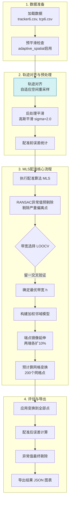

# 点云配准训练流程详解 (MLS + Adaptive Spatial)

本文档详细描述了当前配置下（`tunable_registration.py`）使用 **MLS (移动最小二乘)** 算法配合 **Adaptive Spatial (自适应空间重采样)** 进行点云配准训练的完整工作流程。

---

## 第一阶段：数据准备 (Data Loading)

### 1.1 加载原始轨迹数据
**作用**: 从 CSV 文件中读取 Tracker（动捕系统记录的轨迹）和 TCP（机器人实际运动轨迹）的 3D 坐标序列。

**输入**: 
- `tracker6.csv` - 源点云，通常包含 2000+ 个时间戳的 3D 坐标
- `tcp6.csv` - 目标点云，与源点云记录同一运动过程

**输出**: 两组原始 3D 点序列（N×3 数组）

**为什么需要**: 配准的目标是找到一个变换，将 Tracker 坐标系下的轨迹映射到机器人 TCP 坐标系。

---

### 1.2 预平滑检查
**作用**: 根据后续采用的重采样方法，决定是否对原始数据进行降噪平滑。

**当前配置**: 使用 `adaptive_spatial` 方法，**启用预平滑**（高斯滤波 sigma=1.5）

**为什么需要**: 
- 旧版 `adaptive_spatial` 方法先计算累积弧长，噪声会导致弧长虚高（"海岸线悖论"），预平滑可降低这种影响
- 新版 `chord_spatial` 方法直接测量弦距，不受噪声累积影响，可跳过此步骤

**效果**: 消除高频抖动，使轨迹更平滑，但代价是可能模糊掉真实的动态特征。

---

## 第二阶段：轨迹对齐与预处理 (Preprocessing)

### 2.1 空间重采样 - 统一采样密度
**作用**: 将两条点数不同、采样不均匀的轨迹，重新采样为**相同点数**且**按空间规律分布**的点序列。

#### 当前使用方法 (adaptive_spatial):
1. **计算累积弧长**: `L = Σ||p[i] - p[i-1]||`，得到每个点在轨迹上的"里程"
2. **自适应步长**: 根据噪声水平估算最优采样步长 `Δd = noise_suppression_factor × noise_level`
3. **等弧长插值**: 在弧长轴上每隔 Δd 采样一个点，通过线性插值得到 3D 坐标

**优点**: 实现简单，采样密度与轨迹长度成比例  
**缺点**: 弧长受噪声污染，即使平滑后仍可能存在偏差

#### 备选方法 (chord_spatial):
1. **密集插值**: 先将轨迹加密 50 倍（每段插入 49 个点），使其近似连续曲线
2. **弦距行走**: 从起点出发，测量到后续点的**直线距离**（弦长），当弦长 ≥ Δd 时采样
3. **真实弧长**: 采样完成后再计算弧长，此时的弧长不含噪声虚高

**优点**: 彻底解决海岸线悖论，采样点位置更准确  
**原理**: 噪声造成的往返抖动不增加弦距，只有真正"走远了"才触发采样

**输出**: 两条点数相同（如 729 点）的重采样轨迹

---

### 2.2 后处理平滑
**作用**: 对重采样后的轨迹再次进行高斯平滑（sigma=2.0），进一步消除残留的微小抖动。

**为什么需要**: 
- 重采样后的轨迹虽然采样间隔均匀，但仍可能包含测量噪声
- 后平滑可提升配准质量，特别是对 MLS 这类依赖局部邻域的算法

**效果**: 轨迹变得更加光滑，但会损失少量高频细节。

---

### 2.3 配准前误差统计
**作用**: 在任何变换之前，计算两条轨迹的点对点距离，作为基准线。

**计算**: `error[i] = ||source[i] - target[i]||`

**意义**: 
- 如果配准前误差很小（< 5mm），说明两条轨迹本身就比较接近，可能只需简单刚体变换
- 如果误差很大（> 10mm），说明存在系统性偏差或非刚性形变，需要复杂变换

**当前结果**: 平均 11mm，说明存在一定的手眼标定误差或时间同步偏差。

---

## 第三阶段：MLS 配准核心流程 (MLS Training)

### 3.1 RANSAC 异常值预剔除
**作用**: 在拟合变形场之前，先用随机采样一致性算法剔除"飞点"（严重偏离的点）。

**原理**:
1. 随机抽取 3 个点构成最小样本集
2. 用这 3 个点计算刚体变换（旋转+平移）
3. 统计有多少点在变换后的误差 < 5mm（内点阈值）
4. 重复 200 次，选择内点最多的模型
5. 保留内点，剔除外点

**为什么需要**: 
- Tracker 在遮挡或快速运动时可能产生跳变
- MLS 算法对异常值敏感，一个飞点可能拉坏整片区域的变形场

**当前结果**: 729 → 577 点（剔除 20.9%），说明部分轨迹段存在较大偏差。

---

### 3.2 带宽选择 (LOOCV)
**作用**: MLS 算法的核心参数是带宽 $h$，它决定了每个点"看"多大范围的邻居。LOOCV 通过交叉验证自动找到最优 $h$。

**留一交叉验证流程**:
1. 对每个候选带宽 $h$ (如 0.05, 0.08, 0.10...)
2. 依次"留出"一个训练点
3. 用剩余点对该点做 MLS 变换
4. 计算预测误差
5. 选择总误差最小的 $h$

**带宽的物理意义**:
- **$h$ 越大**: 权重衰减慢，每个点能看到更远的邻居 → 变换更"刚性"（接近全局刚体）
- **$h$ 越小**: 权重衰减快，只看最近的邻居 → 变换更"柔软"（局部形变大），但容易过拟合

**权重公式**: $w_i(s) = \exp\left(-\frac{|s - s_i|^2}{h^2}\right)$

**当前结果**: 选出 $h = 0.026$（过小！），导致训练误差低但泛化差。

---

### 3.3 构建加权邻域模型
**作用**: 对训练数据中的每个点，根据其在归一化弧长轴上的位置 $s \in [0,1]$，计算对所有训练点的权重。

**归一化弧长**: 将实际弧长（如 1463mm）映射到 [0,1] 区间，使得带宽 $h$ 的语义与轨迹长度无关。

**为什么用弧长而非时间**: 弧长反映了点在轨迹上的"几何位置"，相同弧长处的点应该受相似的变换。

**加权 Kabsch 算法**: 
- 对每个查询点 $s$，计算到所有训练点的权重 $w_i(s)$
- 用加权的源点和目标点计算 SVD 分解，得到局部刚体变换 $(R(s), t(s))$
- 不同位置的点有不同的变换矩阵，形成连续的变形场

---

### 3.4 端点镜像延伸
**作用**: 在轨迹首尾两端各镜像复制 10% 的点，解决边界处邻居不足的问题。

**原理**: 
- 轨迹起点（$s=0$）附近的点只有"右侧"邻居，没有"左侧"邻居
- 通过镜像延伸，人为创造"虚拟邻居"，使边界处的权重分布更对称

**具体操作**:
1. 取前 10% 的点，沿轨迹方向镜像到起点之前
2. 取后 10% 的点，沿轨迹方向镜像到终点之后
3. 调整这些镜像点的归一化弧长（如起点前为负值）

**效果**: 577 训练点 → 691 扩展点（两端各增加 57 点）

---

### 3.5 预计算网格变换
**作用**: MLS 每个点都需要实时计算加权 Kabsch SVD，复用时太慢（O(N²)）。通过离线预计算 200 个网格点的变换矩阵，复用时只需插值（O(1)）。

**网格点**: 在归一化弧长 [0,1] 上均匀分布 200 个采样位置

**预计算内容**: 对每个网格点 $s_{\text{grid}}$:
1. 计算对所有训练点（含镜像延伸）的权重 $w_i$
2. 执行加权 Kabsch 算法，得到 4×4 变换矩阵 $T_{\text{grid}}$

**复用时**: 
- 对查询点 $s$，找到最近的两个网格点 $s_{\text{left}}, s_{\text{right}}$
- 计算插值系数 $t = \frac{s - s_{\text{left}}}{s_{\text{right}} - s_{\text{left}}}$
- 对变换结果线性插值: $P' = (1-t) \cdot T_{\text{left}} \cdot P + t \cdot T_{\text{right}} \cdot P$

**存储**: 200 个 4×4 矩阵 ≈ 12.8KB，远小于完整训练数据。

**加速效果**: 从 O(N²) 降低到 O(1) 每点查询。

---

### 3.6 训练误差统计
**作用**: 将 MLS 变换应用回训练数据本身，检查拟合质量。

**指标**:
- **训练 RMSE**: 0.69mm（很低，说明对训练数据拟合很好）
- **训练平均误差**: 0.47mm
- **训练最大误差**: 4.18mm

**警告信号**: 训练误差远低于后续全量误差（5.21mm），说明存在过拟合。

**理想状态**: 训练误差和测试误差应该接近（如都在 2-3mm），差距过大说明模型泛化能力不足。

---

## 第四阶段：评估与导出 (Evaluation)

### 4.1 应用 MLS 变换到全部点
**作用**: 将学到的 MLS 变形场应用到所有 729 个采样点（包括 RANSAC 剔除的 152 个异常值）。

**方法**: 
- 对训练点（577个）：使用完整 MLS 计算（与训练时一致）
- 对其他点：优先使用网格插值（快速）
- 对于网格外的点（极少）：回退到完整 MLS 计算

**输出**: 729 个变换后的 3D 坐标

---

### 4.2 配准后误差计算
**作用**: 统计变换后的源点云与目标点云的残差。

**当前结果**:
- **全量 RMSE**: 5.21mm
- **最大误差**: 25.84mm
- **平均误差**: 2.19mm
- **P95 误差**: 8.86mm

**问题诊断**: 
- 训练 RMSE 0.69mm vs 全量 RMSE 5.21mm → 过拟合
- 最大误差 25.84mm → 可能在 RANSAC 剔除的外点位置或训练稀疏区
- 34 个点超过 11.64mm 阈值（异常值）

---

### 4.3 异常值最终剔除
**作用**: 配准后仍有部分点误差很大（如 > 11.64mm），再次剔除这些统计异常值，得到更客观的精度评估。

**方法**: 
- 计算误差的均值 $\mu$ 和标准差 $\sigma$
- 剔除 $> \mu + k\sigma$ 的点（$k=2$ 或 $k=3$）

**剔除后结果**:
- 剩余 695 点（剔除 34 点，占 4.7%）
- RMSE 降至 2.64mm
- 平均误差 1.29mm
- 最大误差 11.33mm
- P95 误差 7.93mm

**意义**: 
- 这是"正常工况"下的配准精度
- 剔除的 34 个点可能对应 Tracker 跟踪失败、快速运动模糊等特殊情况

---

### 4.4 导出结果文件
**作用**: 将训练好的 MLS 模型保存为 JSON 文件，供后续复用。

**导出内容**:
1. **训练数据**: 577 对源点-目标点 + 归一化弧长
   - 用于"方案A：完整训练数据高精度全量计算"
   
2. **网格变换**: 200 个预计算的 4×4 矩阵
   - 用于"方案B：预计算网格快速复用"
   
3. **元数据**: 
   - 带宽 $h = 0.026$
   - 总弧长 1423.65mm
   - 预处理参数（采样方法、平滑参数等）
   - 训练统计（RMSE、最大误差等）

**文件**: `mls_transform.json` (190.5KB)

**误差图表**: `error_plot.png` - 可视化每个点的误差分布，颜色映射从绿色（低误差）到红色（高误差）

---

## 总结

### 整体流程
数据清洗 → 空间对齐 → 鲁棒拟合 → 网格加速 → 误差评估

### 核心思想
MLS 不是"一次性配准"，而是学习了一个**连续的非刚性变换场** $T(s)$，可以将新的 Tracker 轨迹实时映射到 TCP 坐标系。

### 主要挑战
1. **RANSAC 剔除 20.9% 数据**: 导致训练覆盖不足，某些区域缺乏训练样本
2. **LOOCV 选出带宽过小** ($h=0.026$): 导致严重过拟合，训练误差 0.69mm 但全量误差 5.21mm
3. **预配准误差 11mm**: 说明 Tracker 和 TCP 轨迹差异较大，可能存在手眼标定误差或时间同步问题

### 优化方向
1. 扩大 LOOCV 候选带宽范围，避免选出过小的 $h$
2. 放宽 RANSAC 内点阈值（从 5mm 增加到 8-10mm），减少误剔除
3. 增加网格密度（从 200 增加到 300-500），提升插值精度
4. 检查手眼标定和时间同步，降低预配准误差
