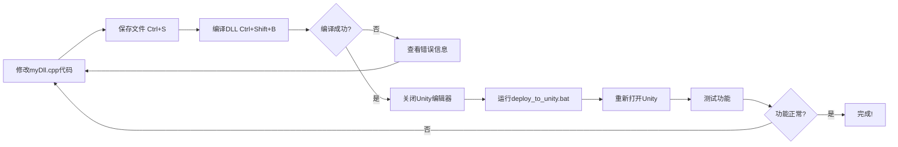

# Visual Studio 2022 编译和替换 myDll.dll 完整指南

## 📋 目录
1. [前置要求](#前置要求)
2. [第一步：打开项目](#第一步打开项目)
3. [第二步：配置编译环境](#第二步配置编译环境)
4. [第三步：编译DLL](#第三步编译dll)
5. [第四步：替换Unity中的DLL](#第四步替换unity中的dll)
6. [自动化部署](#自动化部署)
7. [常见问题解决](#常见问题解决)

---

## 前置要求

### ✅ 必需软件
- **Visual Studio 2022** (已安装)
  - 必须包含"使用C++的桌面开发"工作负载
  - 必须包含"Windows 10/11 SDK"

### ✅ 必需依赖库
- **OpenCV 4.12.0** (已在项目中配置)
  - 位置: `myDll/opencv/`
  - 包含头文件和库文件
  
- **Eigen5** (已在项目中配置)
  - 位置: `myDll/eigen5/`
  - 仅头文件库,无需编译

---

## 第一步:打开项目

### 方式1: 使用解决方案文件(推荐)

1. **定位到项目目录**
   ```
   c:\Users\15421\Desktop\lighthouse_10.9_1_yes\myDll\
   ```

2. **双击打开解决方案文件**
   ```
   myDll.sln
   ```
   

3. **Visual Studio 2022会自动启动并加载项目**

### 方式2: 从Visual Studio打开

1. 启动 **Visual Studio 2022**
2. 点击 **打开项目或解决方案**
3. 浏览到 `c:\Users\15421\Desktop\lighthouse_10.9_1_yes\myDll\myDll.sln`
4. 点击 **打开**

---

## 第二步:配置编译环境

### 1️⃣ 选择正确的配置

#### 在顶部工具栏找到两个下拉框:

```
┌─────────────┐  ┌─────────┐
│   Release   │  │   x64   │
└─────────────┘  └─────────┘
  配置            平台
```

#### ⚠️ 重要配置:
- **配置**: 选择 **`Release`** (不是Debug)
- **平台**: 选择 **`x64`** (不是x86/Win32)

> **为什么选Release?**  
> Unity只使用Release版本的DLL,Debug版本会导致依赖缺失错误

> **为什么选x64?**  
> Unity 2020+默认为64位,需要64位DLL

---

### 2️⃣ 验证项目配置(可选)

#### 右键点击解决方案资源管理器中的 `myDll` 项目 → **属性**

检查以下配置:

#### A. C/C++ → 常规 → 附加包含目录
```
.\eigen5
.\opencv\build\include
```

#### B. 链接器 → 常规 → 附加库目录
```
.\opencv\build\x64\vc16\lib
```

#### C. 链接器 → 输入 → 附加依赖项
```
opencv_world4120.lib
```

#### D. 生成事件 → 后期生成事件 → 命令行
```cmd
xcopy /y /d "$(ProjectDir)opencv\build\x64\vc16\bin\*.dll" "$(OutDir)"
```
> 此命令会自动将OpenCV的DLL复制到输出目录

---

## 第三步:编译DLL

### 🔨 开始编译

#### 方式1: 使用快捷键(推荐)
1. 按 **`Ctrl + Shift + B`** (生成解决方案)

#### 方式2: 使用菜单
1. 点击顶部菜单 **生成** → **生成解决方案**

#### 方式3: 右键菜单
1. 在解决方案资源管理器中右键点击 `myDll` 项目
2. 选择 **生成**

---

### ✅ 编译成功标志

#### 在底部"输出"窗口看到:

```
1>------ 已启动生成: 项目: myDll, 配置: Release x64 ------
1>pch.cpp
1>myDll.cpp
1>dllmain.cpp
1>   正在创建库 x64\Release\myDll.lib 和对象 x64\Release\myDll.exp
1>myDll.vcxproj -> c:\Users\15421\Desktop\lighthouse_10.9_1_yes\myDll\x64\Release\myDll.dll
1>已成功复制文件。
========== 生成: 成功 1 个，失败 0 个，最新 0 个，跳过 0 个 ==========
```

#### 关键信息:
- ✅ **`myDll.dll`** 生成在: `myDll\x64\Release\myDll.dll`
- ✅ **OpenCV DLL** 已自动复制到输出目录
- ✅ **无错误** (失败 0 个)

---

### ❌ 如果编译失败

#### 常见错误1: 找不到opencv头文件
```
fatal error C1083: 无法打开包括文件: "opencv2/opencv.hpp"
```
**解决方案**: 
- 检查 `myDll/opencv/` 目录是否完整
- 验证项目属性中的包含目录是否正确

#### 常见错误2: 找不到opencv库文件
```
LINK : fatal error LNK1181: 无法打开输入文件"opencv_world4120.lib"
```
**解决方案**:
- 检查 `myDll/opencv/build/x64/vc16/lib/opencv_world4120.lib` 是否存在
- 确认平台配置为 **x64**

#### 常见错误3: 找不到Eigen头文件
```
fatal error C1083: 无法打开包括文件: "Eigen/Dense"
```
**解决方案**:
- 检查 `myDll/eigen5/` 目录是否完整
- Eigen目录应包含 `Eigen/` 子文件夹

---

## 第四步:替换Unity中的DLL

### 📍 Unity项目DLL位置

```
c:\Users\15421\Desktop\lighthouse_10.9_1_yes\
└── Assets\
    └── Plugins\
        ├── myDll.dll                    ← 这是你需要替换的文件
        ├── opencv_world4120.dll         ← OpenCV依赖
        ├── opencv_world4120d.dll        ← OpenCV Debug版(可选)
        └── opencv_videoio_ffmpeg4120_64.dll ← FFmpeg依赖
```

---

### 🔄 手动替换步骤

#### 1️⃣ 定位编译后的DLL

导航到编译输出目录:
```
c:\Users\15421\Desktop\lighthouse_10.9_1_yes\myDll\x64\Release\
```

你会看到:
```
myDll.dll                           ← 主DLL
opencv_world4120.dll                ← OpenCV依赖(已自动复制)
opencv_videoio_ffmpeg4120_64.dll    ← FFmpeg依赖(已自动复制)
```

#### 2️⃣ **重要**: 关闭Unity编辑器

> ⚠️ **必须先关闭Unity!**  
> 如果Unity正在运行,DLL文件会被锁定无法替换

#### 3️⃣ 复制myDll.dll

**方式A: 手动复制**
1. 复制 `myDll\x64\Release\myDll.dll`
2. 粘贴到 `Assets\Plugins\myDll.dll`
3. 选择 **替换目标中的文件**

**方式B: 使用资源管理器快速操作**
1. 同时打开两个文件夹窗口:
   - 源文件夹: `myDll\x64\Release\`
   - 目标文件夹: `Assets\Plugins\`
2. 拖拽 `myDll.dll` 到目标文件夹
3. 确认替换

#### 4️⃣ 验证文件已替换

右键点击 `Assets\Plugins\myDll.dll` → **属性** → **详细信息**

检查:
- **修改日期**: 应该是刚才编译的时间
- **文件大小**: Release版通常比Debug版小

#### 5️⃣ (可选) 同时更新OpenCV DLL

如果你更新了OpenCV版本,也需要复制:
```
myDll\x64\Release\opencv_world4120.dll  
  → Assets\Plugins\opencv_world4120.dll

myDll\x64\Release\opencv_videoio_ffmpeg4120_64.dll  
  → Assets\Plugins\opencv_videoio_ffmpeg4120_64.dll
```

#### 6️⃣ 重新打开Unity

1. 启动Unity编辑器
2. Unity会自动检测DLL变化并重新加载
3. 查看Console窗口确认无错误

---

## 自动化部署

### 🚀 使用批处理脚本一键部署

为了简化重复操作,我已为你创建了自动化脚本。

#### 脚本位置
```
c:\Users\15421\Desktop\lighthouse_10.9_1_yes\myDll\deploy_to_unity.bat
```

#### 使用方法

1. **编译DLL** (按照第三步操作)
2. **双击运行** `deploy_to_unity.bat`
3. **脚本自动完成**:
   - ✅ 检查Unity是否在运行
   - ✅ 复制 `myDll.dll` 到Unity
   - ✅ 复制 OpenCV DLL 到Unity
   - ✅ 显示成功消息

#### 脚本特性
- 🛡️ **自动备份**: 替换前备份旧DLL到 `Assets\Plugins\Backup\`
- 🕐 **时间戳**: 备份文件带日期时间标记
- ⚠️ **Unity检测**: 如果Unity正在运行会提示关闭
- 📝 **详细日志**: 显示每个操作的结果

---

### 🔧 VS 2022 后期生成事件集成(高级)

#### 如果你想每次编译后自动部署,可以配置后期生成事件:

1. 右键点击 `myDll` 项目 → **属性**
2. 展开 **生成事件** → **后期生成事件**
3. 在 **命令行** 中添加:

```cmd
REM 自动部署到Unity
echo 正在部署DLL到Unity...
xcopy /y /d "$(TargetPath)" "$(ProjectDir)..\Assets\Plugins\"
xcopy /y /d "$(OutDir)opencv_world4120.dll" "$(ProjectDir)..\Assets\Plugins\"
xcopy /y /d "$(OutDir)opencv_videoio_ffmpeg4120_64.dll" "$(ProjectDir)..\Assets\Plugins\"
echo DLL部署完成！
```

4. 点击 **应用** → **确定**

#### 效果
- 每次编译成功后自动复制DLL到Unity
- ⚠️ **注意**: Unity必须关闭,否则会复制失败

---

## 常见问题解决

### ❓ Q1: Unity Console显示 "DllNotFoundException: myDll"

**原因**: Unity找不到DLL文件

**解决方案**:
1. 确认 `Assets\Plugins\myDll.dll` 存在
2. 检查DLL是否为64位 (使用 [Dependency Walker](https://www.dependencywalker.com/) 工具)
3. 确认OpenCV依赖DLL也在 `Assets\Plugins\` 中

---

### ❓ Q2: Unity Console显示 "EntryPointNotFoundException"

**原因**: DLL中找不到导出的函数

**解决方案**:
1. 检查 `myDll.cpp` 中的函数是否有 `extern "C" __declspec(dllexport)`
2. 确认函数名拼写与Unity C#代码中的 `[DllImport("myDll.dll", EntryPoint = "函数名")]` 一致
3. 使用 [DLL Export Viewer](https://www.nirsoft.net/utils/dll_export_viewer.html) 查看DLL导出的函数列表

---

### ❓ Q3: Unity加载DLL时崩溃/闪退

**原因**: DLL依赖缺失或版本不匹配

**解决方案**:
1. 确保使用 **Release x64** 配置编译
2. 复制所有OpenCV DLL到 `Assets\Plugins\`:
   - `opencv_world4120.dll`
   - `opencv_videoio_ffmpeg4120_64.dll`
3. 使用 [Dependencies](https://github.com/lucasg/Dependencies) 工具检查DLL依赖链

---

### ❓ Q4: 替换DLL后Unity无法检测到更新

**原因**: Unity缓存了旧版本DLL

**解决方案**:
1. 完全关闭Unity编辑器
2. 删除 `Library\` 文件夹(Unity会自动重新生成)
3. 重新打开Unity项目

---

### ❓ Q5: Visual Studio提示 "无法启动程序 myDll.dll"

**原因**: 你尝试直接运行DLL(DLL不是可执行文件)

**解决方案**:
- DLL不能直接运行,只能被其他程序(如Unity)调用
- 编译成功后直接替换到Unity即可
- 如需调试,可以创建C++测试程序或使用Unity调试

---

### ❓ Q6: 编译成功但文件大小为0KB

**原因**: 链接器失败但未报告错误

**解决方案**:
1. 检查 **输出** 窗口的完整日志
2. 查看 **错误列表** (Ctrl+\, E)
3. 清理解决方案: **生成** → **清理解决方案**
4. 重新生成: **生成** → **重新生成解决方案**

---

## 🎯 完整工作流程总结

### 标准开发流程:



### 快捷操作一览:

| 操作 | 快捷键/命令 |
|------|------------|
| 保存所有文件 | `Ctrl + Shift + S` |
| 编译解决方案 | `Ctrl + Shift + B` |
| 清理解决方案 | `Shift + Alt + C` |
| 重新生成解决方案 | `Ctrl + Alt + F7` |
| 查看输出窗口 | `Ctrl + Alt + O` |
| 查看错误列表 | `Ctrl + \, E` |
| 一键部署 | 双击 `deploy_to_unity.bat` |

---

## 📞 需要帮助?

### 检查清单:

- [ ] 使用 Visual Studio 2022
- [ ] 编译配置为 **Release x64**
- [ ] OpenCV 和 Eigen 库路径正确
- [ ] 编译输出显示 "成功 1 个"
- [ ] Unity编辑器已关闭
- [ ] DLL文件大小正常(不是0KB)
- [ ] 所有依赖DLL都在 `Assets\Plugins\`
- [ ] Unity Console无DLL加载错误

### 调试技巧:

1. **查看详细编译日志**:
   - 工具 → 选项 → 项目和解决方案 → 生成并运行
   - MSBuild项目生成输出详细信息: **详细**

2. **检查DLL导出函数**:
   - 使用 [DLL Export Viewer](https://www.nirsoft.net/utils/dll_export_viewer.html)
   - 验证所有需要的函数都已导出

3. **检查DLL依赖**:
   - 使用 [Dependencies](https://github.com/lucasg/Dependencies)
   - 确认所有依赖库都能找到

---

**祝你编译顺利! 🎉**
